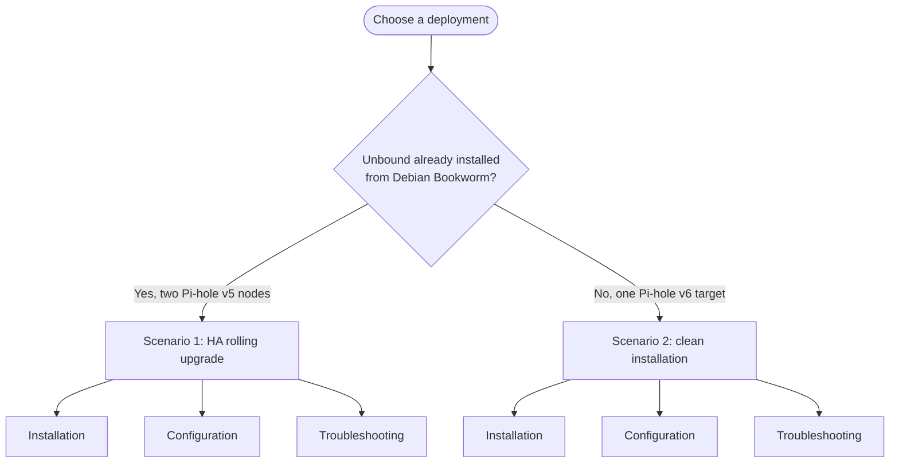

# 🧭 Unbound Documentation Index

Use this index to select the runbook matching the target. The procedures are
written for Linux administrators and assume command-line access with `sudo`.

## 🔄 Scenario 1: Pi-hole v5 HA upgrade

- [Installation and rolling upgrade](scenario-1-ha-upgrade-installation.md)
- [Configuration reference](scenario-1-ha-configuration.md)
- [Troubleshooting and rollback](scenario-1-ha-troubleshooting.md)

Use Scenario 1 for:

- `pihole0` at `10.1.0.53`.
- `pihole00` at `10.1.0.54`.
- Keepalived DNS VIP `10.1.0.55`.
- Pi-hole v5 forwarding to local Unbound on port `5335`.
- Preserving `local.theama.co` and Cloudflare DNS-over-TLS forwarding.

## 🆕 Scenario 2: clean Pi-hole v6 target

- [Clean installation](scenario-2-clean-installation.md)
- [Configuration reference](scenario-2-clean-configuration.md)
- [Troubleshooting and rollback](scenario-2-clean-troubleshooting.md)

Use Scenario 2 for a single Debian 12 arm64 Raspberry Pi 5 running Pi-hole v6.
The generic profile performs full DNSSEC-validating recursion and contains no
private local-zone records.

## 🧱 Architecture diagrams

The LikeC4 model is canonical; these images are generated views:

- [HA DNS deployment](assets/likec4/dns-ha.png)
- [HA DNS-over-TLS query](assets/likec4/dns-ha-dot-query.png)
- [HA rolling upgrade](assets/likec4/dns-ha-upgrade.png)
- [Clean Pi-hole v6 deployment](assets/likec4/unbound-pihole-v6-reference.png)
- [Recursive DNS query](assets/likec4/unbound-recursive-query.png)
- [Diagram provenance](assets/likec4/PROVENANCE.md)

## ⚙️ Focused references

- [Pi-hole and Unbound local-zone guide](Pi-hole-with-Unbound-local-zone-guide.md)
- [Debian 12 Raspberry Pi 5 socket-buffer tuning](README-net-core-sysctl-debian12-rpi5.md)

## 🔍 Architecture drift checks

The canonical LikeC4 sources live in `homelab-docs/architecture/likec4` and
map the DNS components back to `https://github.com/Racerx323/homelab-dns`.
Erode runs in advisory mode on non-draft pull requests. Local maintainers can
run `erode-drift --branch main`; deterministic `likec4 validate` remains the
required source-model check.

## 📚 Authoritative references

- [NLnet Labs Unbound documentation](https://unbound.docs.nlnetlabs.nl/)
- [Pi-hole Unbound guide](https://docs.pi-hole.net/guides/dns/unbound/)
- [Pi-hole v6 configuration reference](https://docs.pi-hole.net/ftldns/configfile/)
