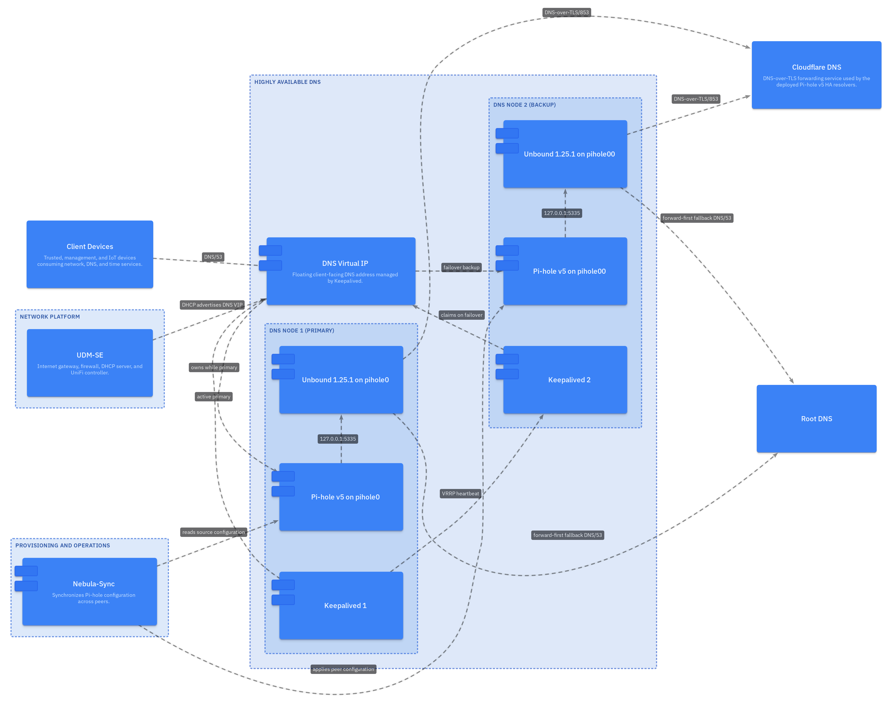
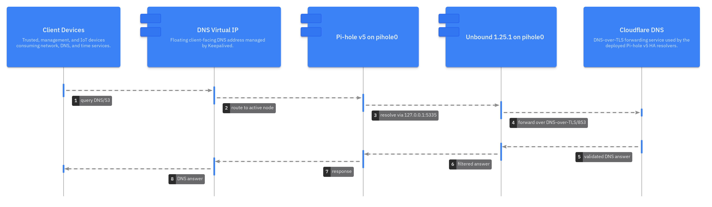
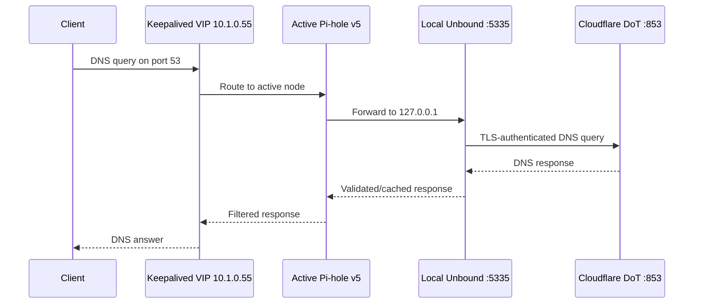

# ⚙️ Scenario 1: Pi-hole v5 HA Configuration

This guide records the intended post-upgrade configuration. The existing
`/etc/unbound/unbound.conf.d/pihole.conf` remains authoritative and is changed
only when Unbound 1.25.1 reports an error or an operational test proves a
conflict.

This guide implements the
[Unbound 1.25.1 scenario requirements](unbound-1.25-requirements.md).



## 🌐 DNS request path





The active node always uses its own local Unbound instance. Cross-node
forwarding is not configured.

## ⚙️ Listener and access controls

Required settings in `pihole.conf`:

```conf
server:
    interface: 127.0.0.1
    interface: ::1
    port: 5335
    access-control: 127.0.0.1 allow
    access-control: ::1 allow
    do-ip4: yes
    do-ip6: yes
    do-udp: yes
    do-tcp: yes
    prefer-ip6: no
```

Verify on each node:

```bash
sudo unbound-checkconf /etc/unbound/unbound.conf
sudo ss -lntup | grep -E '(:5335[[:space:]])'
```

Expected: only loopback addresses listen on port 5335. LAN clients reach
Pi-hole on port 53 through the VIP, never Unbound directly.

## 🔐 DNSSEC, privacy, and rebinding controls

Retain:

- The Debian-managed trust anchor at `/var/lib/unbound/root.key`.
- `harden-glue`, `harden-dnssec-stripped`, and `qname-minimisation`.
- `hide-identity`, `hide-version`, `minimal-responses`, and `deny-any`.
- `edns-buffer-size: 1232`.
- Private IPv4, IPv6, link-local, and mapped-address protections.
- `private-domain` and `domain-insecure` for `local.theama.co`.

Verify the trust anchor is writable by the Unbound service account:

```bash
sudo namei -l /var/lib/unbound/root.key
sudo -u unbound test -r /var/lib/unbound/root.key
sudo -u unbound test -w /var/lib/unbound/root.key
```

## 🌐 Cloudflare DNS-over-TLS forwarding

The HA deployment intentionally retains:

```conf
server:
    tls-cert-bundle: /etc/ssl/certs/ca-certificates.crt

forward-zone:
    name: "."
    forward-tls-upstream: yes
    forward-first: yes
    forward-addr: 1.1.1.1@853#cloudflare-dns.com
    forward-addr: 1.0.0.1@853#cloudflare-dns.com
    forward-addr: 2606:4700:4700::1111@853#cloudflare-dns.com
    forward-addr: 2606:4700:4700::1001@853#cloudflare-dns.com
```

`forward-first: yes` permits ordinary recursive DNS fallback when all
forwarders fail. This availability behavior is deliberate; it is not strict
DoT. Validate time and TLS before blaming DNS:

```bash
timedatectl status
openssl s_client -connect 1.1.1.1:853 \
  -servername cloudflare-dns.com -verify_return_error </dev/null
```

## 🌐 Local zone ownership

Unbound owns `local.theama.co`; Pi-hole owns blocking and client service. Keep
the A, PTR, and SRV data identical on both nodes and avoid duplicate Pi-hole
Local DNS entries.

```bash
dig @127.0.0.1 -p 5335 pihole.local.theama.co A
dig @127.0.0.1 -p 5335 _smtp._tcp.local.theama.co SRV
dig @127.0.0.1 -p 5335 -x 10.1.0.55
```

See the [local-zone guide](Pi-hole-with-Unbound-local-zone-guide.md) for
Pi-hole private reverse lookup behavior and failover validation.

## 📊 Performance and kernel settings

The current Raspberry Pi 5 profile uses four threads, eight cache slabs,
256 MiB RRset cache, 128 MiB message cache, and 4 MiB send/receive buffers.
Keep these values unless measurement justifies a change.

```bash
sysctl net.core.rmem_max net.core.wmem_max
sudo unbound-control stats_noreset | sed -n '1,80p'
```

Both sysctls must be at least `4194304`. Apply the documented persistent
drop-in on both nodes; see the [socket-buffer guide](README-net-core-sysctl-debian12-rpi5.md).

## 📊 Logging, rotation, and AppArmor

The site configuration logs to `/var/log/unbound/unbound.log`. The directory
and rotation policy must allow the `unbound` user to reopen the file:

```bash
sudo namei -l /var/log/unbound/unbound.log
sudo logrotate --debug /etc/logrotate.d/unbound
sudo unbound-control log_reopen
sudo apparmor_status | grep -i unbound || true
```

The local AppArmor rule must grant write access to the exact log path. Keep
normal verbosity low and do not enable query logging or DNSTAP without a
retention and privacy review.

## ⚙️ Remote control and volatile paths

Verify the control channel and runtime directory:

```bash
sudo unbound-control status
sudo unbound-control stats_noreset | sed -n '1,40p'
sudo ls -ld /run/unbound
sudo systemd-tmpfiles --create
```

DNSTAP remains compiled in but disabled. Its reserved socket path is
`/run/unbound/dnstap.sock`.

## ⚙️ Pi-hole v5 upstreams

In **Settings → DNS → Upstream DNS Servers**, select only:

```text
Custom 1 (IPv4): 127.0.0.1#5335
Custom 3 (IPv6): ::1#5335
```

Do not select public Pi-hole upstreams. Restart and verify:

```bash
sudo pihole restartdns
dig @127.0.0.1 dnssec.works A +dnssec
sudo tail -n 100 /var/log/pihole/pihole.log
```

## 🔐 Resolver helper protection

On Debian 12, prevent `unbound-resolvconf.service` from putting an unusable
port-53 loopback entry into `/etc/resolv.conf`:

```bash
sudo systemctl disable --now unbound-resolvconf.service 2>/dev/null || true
sudo rm -f /etc/unbound/unbound.conf.d/resolvconf_resolvers.conf
systemctl is-enabled unbound-resolvconf.service 2>/dev/null || true
cat /etc/resolv.conf
```

## ✅ Compatibility classification

| Configuration area | Policy for 1.25.1 | Required check |
| --- | --- | --- |
| Interfaces, port, access controls | Retain | Loopback-only `ss` output |
| Local A, PTR, and SRV records | Retain | Direct, node, and VIP `dig` |
| Cloudflare DoT and `forward-first` | Retain | TLS handshake and public query |
| DNSSEC and trust anchor | Operationally verify | Valid AD; bogus SERVFAIL |
| IPv4 and native IPv6 | Retain | A/AAAA queries and reachability |
| Cache, threads, slabs | Retain | Memory and `unbound-control stats` |
| EDNS 1232 and hardening | Retain | Config validation and DNSSEC tests |
| 4 MiB socket buffers | Retain | Sysctls and warning-free restart |
| File logging and logrotate | Correct only if reopen fails | Rotation rehearsal |
| AppArmor local rule | Correct only on denial | Audit log and parser reload |
| Remote-control paths | Correct only if invalid | `unbound-control status` |
| DNSTAP | Retain disabled | No collector socket errors |
| Deprecated/removed directive | Correct only if 1.25.1 rejects it | Reviewed minimal diff |

## ✅ Final validation

```bash
sudo unbound-checkconf /etc/unbound/unbound.conf
systemctl is-active unbound pihole-FTL keepalived
dig @127.0.0.1 -p 5335 dnssec.works A +dnssec
dig @127.0.0.1 -p 5335 fail01.dnssec.works A +dnssec
dig @10.1.0.55 pihole.local.theama.co A
sudo journalctl -u unbound -b --no-pager
```

Expected: valid DNSSEC returns `NOERROR` with `ad`, the deliberately broken
domain returns `SERVFAIL`, local data resolves, and logs contain no recurring
errors.

## 📚 Related documentation

- [Unbound 1.25.1 scenario requirements](unbound-1.25-requirements.md)
- [Scenario 1 installation](scenario-1-ha-upgrade-installation.md)
- [Scenario 1 troubleshooting](scenario-1-ha-troubleshooting.md)
