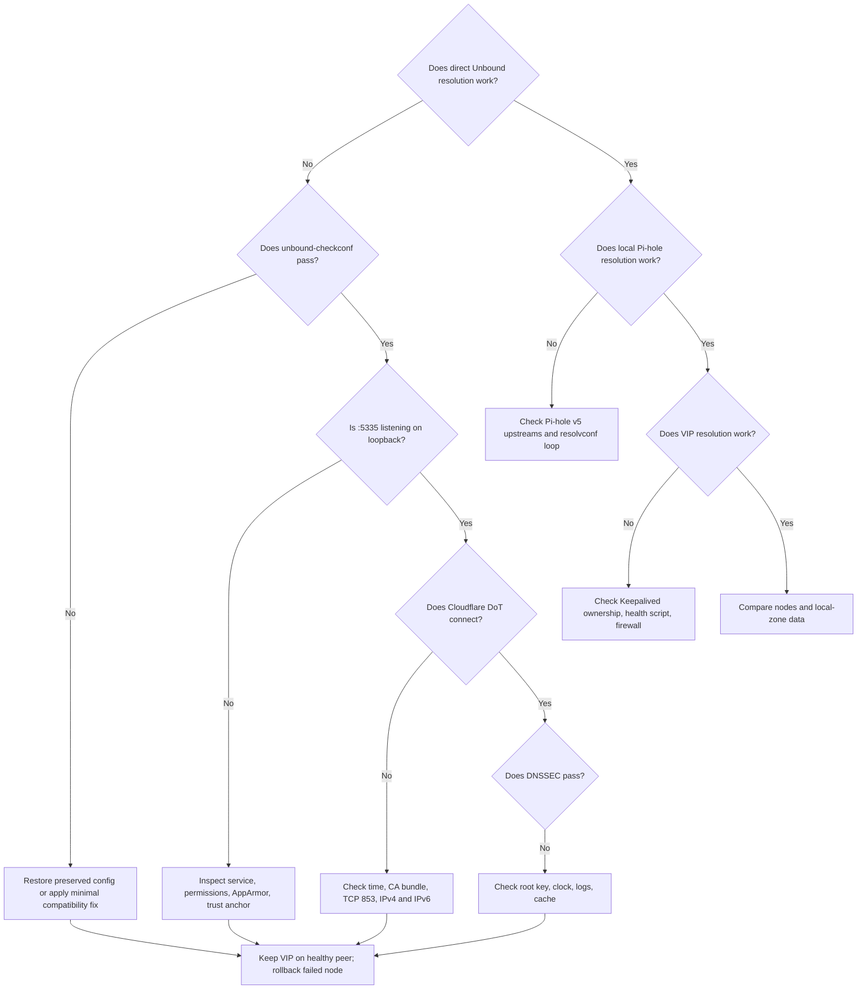

# 🧯 Scenario 1: Pi-hole v5 HA Troubleshooting

Diagnose from the local Unbound process outward. Keep the VIP on the healthy
peer while investigating a failed node.

Use the [Unbound 1.25.1 scenario requirements](unbound-1.25-requirements.md)
as the baseline when deciding whether a repair preserves the intended design.

## 🧭 Triage decision tree



## 📋 Capture evidence first

Run on the affected node before restarting repeatedly:

```bash
date -u
hostnamectl
ip -brief address
systemctl status unbound pihole-FTL keepalived --no-pager
sudo journalctl -u unbound -b --no-pager
sudo unbound-checkconf /etc/unbound/unbound.conf
sudo ss -lntup
sudo unbound-control status || true
dpkg-query -W 'unbound*' 'libunbound*' 2>/dev/null
```

Save the output with the incident record. Do not delete caches, keys, or
configuration until evidence and backups exist.

## 🏗️ Package or dependency failure

```bash
sudo dpkg --audit
sudo apt --fix-broken install
apt-cache policy unbound libunbound8
ldd /usr/sbin/unbound
```

All linked libraries must resolve and the Unbound packages must share the
same backport version. If `apt --fix-broken` proposes removing Pi-hole or core
network packages, decline and restore the previous package set.

## ⚙️ Configuration was rejected or replaced

```bash
sudo unbound-checkconf /etc/unbound/unbound.conf
sudo find /etc/unbound -maxdepth 2 \
  \( -name '*.dpkg-dist' -o -name '*.dpkg-old' -o -name '*.ucf-*' \) -print
sudo sha256sum /etc/unbound/unbound.conf.d/pihole.conf
```

Compare the checksum with the pre-upgrade inventory. Restore the local file
when an unattended package candidate replaced it. For a genuine 1.25.1
syntax error, change only the rejected directive and retain a reviewed diff.

## ⚙️ Service, permissions, or AppArmor failure

```bash
sudo journalctl -u unbound -b --no-pager
sudo journalctl -k -b | grep -i apparmor || true
sudo namei -l /var/lib/unbound/root.key
sudo namei -l /var/log/unbound/unbound.log
sudo apparmor_parser -r /etc/apparmor.d/usr.sbin.unbound
sudo systemctl restart unbound
```

Do not disable AppArmor globally. Correct only the missing path permission in
`/etc/apparmor.d/local/usr.sbin.unbound` and reload the profile.

## 🌐 Port 5335 or resolver loop

```bash
sudo ss -lntup | grep -E '(:53|:5335)[[:space:]]'
systemctl is-active unbound-resolvconf.service 2>/dev/null || true
cat /etc/resolv.conf
```

Pi-hole owns port 53; Unbound owns loopback port 5335. Disable
`unbound-resolvconf.service` and remove its generated include if the host
resolver points to `127.0.0.1` without a port.

## 🔐 Cloudflare DoT failure

```bash
timedatectl status
getent hosts cloudflare-dns.com
openssl s_client -connect 1.1.1.1:853 \
  -servername cloudflare-dns.com -verify_return_error </dev/null
openssl s_client -connect '[2606:4700:4700::1111]:853' \
  -servername cloudflare-dns.com -verify_return_error </dev/null
```

Check the firewall for outbound TCP 853 and confirm the CA bundle exists. If
only IPv6 fails, repair native IPv6 or temporarily remove the IPv6 forwarders
through a reviewed configuration change; do not mask repeated TLS failures.

## 🔐 DNSSEC or trust-anchor failure

```bash
ls -l /var/lib/unbound/root.key
sudo -u unbound unbound-anchor -a /var/lib/unbound/root.key -v
dig @127.0.0.1 -p 5335 dnssec.works A +dnssec
dig @127.0.0.1 -p 5335 fail01.dnssec.works A +dnssec
```

Expected: the valid domain returns `NOERROR` with `ad`; the bogus domain
returns `SERVFAIL`. Confirm system time before replacing the trust anchor.

## 🌐 Pi-hole v5 forwarding failure

Confirm the Pi-hole UI selects only `127.0.0.1#5335` and `::1#5335`, then:

```bash
sudo pihole restartdns
dig @127.0.0.1 cloudflare.com A
sudo tail -n 200 /var/log/pihole/pihole.log
```

If direct Unbound works but Pi-hole does not, the fault is in Pi-hole upstream
selection, a duplicate local record, private reverse-lookup policy, or FTL.

## 🌐 Local A, PTR, or SRV mismatch

```bash
dig @127.0.0.1 -p 5335 pihole.local.theama.co A
dig @127.0.0.1 -p 5335 -x 10.1.0.55
dig @127.0.0.1 -p 5335 _smtp._tcp.local.theama.co SRV
sudo sha256sum /etc/unbound/unbound.conf.d/pihole.conf
```

Compare checksums across nodes. Copy only a reviewed configuration from the
authoritative source; do not merge ad hoc DNS records during an outage.

## 📊 Socket-buffer warning

```bash
sysctl net.core.rmem_max net.core.wmem_max
sudo journalctl -u unbound -b --no-pager | grep -Ei 'buffer|rcvbuf|sndbuf' || true
```

Both maximums must be at least `4194304` for the configured 4 MiB buffers.
Apply the [socket-buffer guide](README-net-core-sysctl-debian12-rpi5.md) on
both nodes and restart Unbound once.

## 🔄 Keepalived or asymmetric-node failure

```bash
ip -brief address
systemctl status keepalived --no-pager
sudo journalctl -u keepalived -b --no-pager
dig @10.1.0.53 pihole.local.theama.co A
dig @10.1.0.54 pihole.local.theama.co A
dig @10.1.0.55 pihole.local.theama.co A
```

If only one node fails, keep the VIP on the healthy node. Do not re-enable a
failed node in keepalived until direct Unbound and local Pi-hole queries pass.

## ↩️ Safe rollback

Use the exact backup directory and package versions captured before upgrade.
Follow [the installation rollback](scenario-1-ha-upgrade-installation.md#%EF%B8%8F-rollback-boundary).
After downgrade, validate configuration, direct queries, Pi-hole forwarding,
and only then restart keepalived.

## 📚 Escalation record

Attach service logs, package inventory, configuration diff, affected node,
VIP owner, timestamps, DNS test results, and rollback actions. Never include
private control keys or provider credentials.

## 📚 Related documentation

- [Unbound 1.25.1 scenario requirements](unbound-1.25-requirements.md)
- [Scenario 1 installation](scenario-1-ha-upgrade-installation.md)
- [Scenario 1 configuration](scenario-1-ha-configuration.md)
