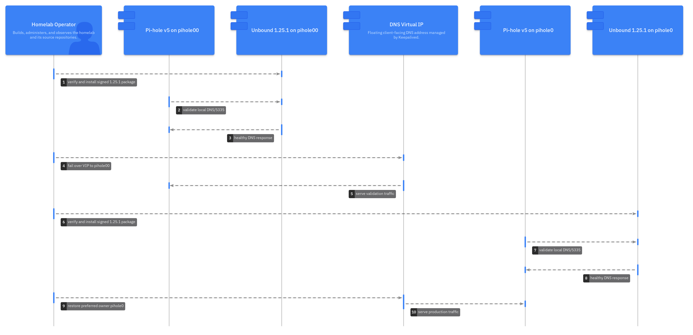
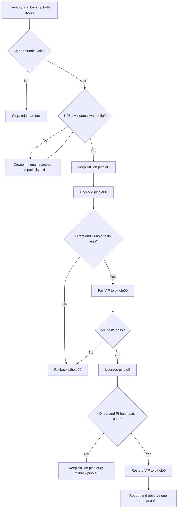

# 🔄 Scenario 1: HA Unbound Upgrade Installation

This runbook replaces Debian Bookworm's Unbound 1.17.1 packages with the
signed Unbound 1.25.1 Bookworm backport on the two Pi-hole v5 nodes. Upgrade
one node at a time and keep the DNS VIP on the known-good peer.

This runbook implements the
[Unbound 1.25.1 scenario requirements](unbound-1.25-requirements.md).



## 📋 Scope and safety rules

- Run host commands over SSH on the node named by each step.
- Run workstation commands from the verified release-bundle directory.
- Never upgrade, reboot, or downgrade both DNS nodes together.
- Preserve `/etc/unbound/unbound.conf.d/pihole.conf` unless Unbound 1.25.1
  rejects it. A warning alone is not permission to redesign it.
- Stop at every failed health gate and use the rollback section.

The executable gates mirror this runbook. On each standby node, use
`ha-preflight.sh` with the extracted 1.25.1 `unbound-checkconf`, then use
`ha-upgrade-node.sh` only after reviewing its backup. `ha-rollback-node.sh`
performs the cached one-node downgrade. The explicit VIP moves and site A,
PTR, and SRV review remain operator-controlled.



## 🔐 Verify the release bundle

On the administrator workstation, enter the extracted release directory. The
bundle must contain `SHA256SUMS`, `SHA256SUMS.asc`, build metadata, and the
runtime package set under `packages/`.

```bash
gpg --verify SHA256SUMS.asc SHA256SUMS
sha256sum --check SHA256SUMS
```

Expected: a trusted release-key signature and `OK` for every artifact. Do not
install a bundle with a missing key, bad signature, checksum mismatch, or
unexpected file. Acquiring and trusting the release key is a separate,
out-of-band administrative action.

## 📊 Inventory both nodes

Run on `pihole0`, then `pihole00`:

```bash
hostnamectl
dpkg --print-architecture
cat /etc/debian_version
pihole -v
unbound -V
dpkg-query -W 'unbound*' 'libunbound*' 2>/dev/null
systemctl status unbound keepalived pihole-FTL --no-pager
systemctl is-enabled unbound-resolvconf.service 2>/dev/null || true
ss -lntup
ip -brief address
sysctl net.core.rmem_max net.core.wmem_max
timedatectl status
sudo unbound-checkconf /etc/unbound/unbound.conf
```

Expected: Debian 12 `arm64`, healthy services, Unbound listening only on
loopback port 5335, and exactly one node holding `10.1.0.55`.

## 🔐 Back up state and current packages

Run on each node. Use a node-local path so one backup cannot overwrite the
other.

```bash
backup_root="/var/backups/unbound-upgrade-$(date -u +%Y%m%dT%H%M%SZ)"
sudo install -d -m 0700 "$backup_root"
sudo tar -C / -czf "$backup_root/unbound-configuration.tgz" \
  etc/unbound var/lib/unbound
sudo install -d -m 0700 "$backup_root/host-files"
sudo cp -a --parents \
  /etc/apparmor.d/usr.sbin.unbound \
  /etc/apparmor.d/local/usr.sbin.unbound \
  /etc/sysctl.d/unbound-socket-buffers.conf \
  "$backup_root/host-files" 2>/dev/null || true
if [[ -d /etc/systemd/system/unbound.service.d ]]; then
  sudo cp -a --parents /etc/systemd/system/unbound.service.d \
    "$backup_root/host-files"
fi
sudo cp -a /etc/pihole "$backup_root/pihole"
sudo systemctl cat unbound >"/tmp/unbound-unit.txt"
sudo mv /tmp/unbound-unit.txt "$backup_root/unbound-unit.txt"
dpkg-query -W -f='${binary:Package}\t${Version}\n' \
  'unbound*' 'libunbound*' | sudo tee "$backup_root/packages.tsv" >/dev/null
package_cache="$(mktemp -d /tmp/unbound-bookworm-packages.XXXXXX)"
(
  cd "$package_cache"
  apt-get download "unbound=$(dpkg-query -W -f='${Version}' unbound)"
  apt-get download "libunbound8=$(dpkg-query -W -f='${Version}' libunbound8)"
)
sudo install -d -m 0700 "$backup_root/packages"
sudo mv "$package_cache"/*.deb "$backup_root/packages/"
rmdir "$package_cache"
sudo sha256sum /etc/unbound/unbound.conf \
  /etc/unbound/unbound.conf.d/*.conf | sudo tee "$backup_root/config.sha256" >/dev/null
sudo ls -la "$backup_root"
```

Expected: a mode-0700 backup directory containing configuration, package
inventory, checksums, and at least the current `unbound` package. Download the
matching `libunbound8` and other downgradable packages if they are not already
present in `/var/cache/apt/archives`.

## ✅ Validate the live configuration with 1.25.1

Copy the runtime packages to a temporary staging directory on each node, then
extract without installing:

```bash
stage_root="$(mktemp -d /tmp/unbound-1.25.1-check.XXXXXX)"
for package_file in ./packages/*.deb; do
  dpkg-deb --extract "$package_file" "$stage_root"
done
sudo env LD_LIBRARY_PATH="$stage_root/usr/lib/aarch64-linux-gnu" \
  "$stage_root/usr/sbin/unbound-checkconf" /etc/unbound/unbound.conf
```

Expected: `unbound-checkconf: no errors`. Remove the temporary directory only
after recording the result:

```bash
sudo rm -rf -- "$stage_root"
```

If validation fails, do not install. Copy `pihole.conf`, make the smallest
possible compatibility correction, validate it with both versions, and retain
a reviewed `diff -u` beside the change record.

## 🚀 Upgrade standby node pihole00

Confirm the VIP remains on `pihole0`:

```bash
ip address show | grep -F '10.1.0.55' || true
```

On `pihole00`, install the verified runtime package set:

```bash
sudo apt update
sudo apt install ./packages/*.deb
```

If `dpkg` asks about an Unbound conffile, select **keep the local version**.
After installation, inspect the packaged candidate separately; do not replace
the live file during the maintenance window.

Disable the incompatible resolver helper and validate the service:

```bash
sudo systemctl disable --now unbound-resolvconf.service 2>/dev/null || true
sudo rm -f /etc/unbound/unbound.conf.d/resolvconf_resolvers.conf
sudo unbound-checkconf /etc/unbound/unbound.conf
sudo systemctl restart unbound
systemctl status unbound --no-pager
unbound -V
sudo journalctl -u unbound -b --no-pager
```

Expected: version 1.25.1, active service, and no configuration, permission,
TLS, trust-anchor, or socket-buffer errors.

## ✅ Validate pihole00 before failover

```bash
dig @127.0.0.1 -p 5335 cloudflare.com A +dnssec
dig @::1 -p 5335 cloudflare.com AAAA +dnssec
dig @127.0.0.1 -p 5335 pihole.local.theama.co A
dig @127.0.0.1 -p 5335 _smtp._tcp.local.theama.co SRV
dig @127.0.0.1 -p 5335 -x 10.1.0.1
dig @127.0.0.1 cloudflare.com A
sudo tail -n 100 /var/log/pihole/pihole.log
```

Expected: public and local answers succeed; Pi-hole logs show forwarding to
`127.0.0.1#5335`.

## 🔄 Fail over and upgrade pihole0

On `pihole0`, stop keepalived to release the VIP:

```bash
sudo systemctl stop keepalived
```

On `pihole00`, verify ownership and query through the VIP:

```bash
ip address show | grep -F '10.1.0.55'
dig @10.1.0.55 cloudflare.com A +dnssec
dig @10.1.0.55 pihole.local.theama.co A
dig @10.1.0.55 _smtp._tcp.local.theama.co SRV
dig @10.1.0.55 -x 10.1.0.1
```

If all tests pass, repeat the package installation and direct checks on
`pihole0`. Start keepalived on `pihole0`, confirm the preferred role returns,
and repeat the VIP queries:

```bash
sudo systemctl start keepalived
ip address show | grep -F '10.1.0.55'
```

## ✅ Reboot validation and observation

Reboot the standby first, validate it, then reboot the primary. On each node:

```bash
sudo reboot
```

After reconnecting:

```bash
systemctl status unbound keepalived pihole-FTL --no-pager
unbound -V
sysctl net.core.rmem_max net.core.wmem_max
sudo unbound-checkconf /etc/unbound/unbound.conf
sudo journalctl -u unbound -b --no-pager
dig @127.0.0.1 -p 5335 dnssec.works A +dnssec
```

Observe both nodes through at least one normal operational cycle before
deleting backups or cached packages.

## ↩️ Rollback boundary

At any failed health gate, keep or move the VIP to the healthy peer. On the
failed node, set `rollback_root` to the exact backup created on that node,
stop Unbound, reinstall the complete cached Bookworm package set, and restore
that backup:

```bash
rollback_root="/var/backups/unbound-upgrade-YYYYMMDDTHHMMSSZ"
sudo systemctl stop unbound
sudo apt install --allow-downgrades "$rollback_root"/packages/*.deb
sudo tar -C / -xzf "$rollback_root/unbound-configuration.tgz"
sudo cp -a "$rollback_root/host-files/." /
sudo unbound-checkconf /etc/unbound/unbound.conf
sudo systemctl restart unbound
```

Replace the timestamp placeholder and inspect the package directory before
running the downgrade. Do not return the node to keepalived until direct and
Pi-hole queries pass.

## 📚 Related documentation

- [Unbound 1.25.1 scenario requirements](unbound-1.25-requirements.md)
- [Scenario 1 configuration](scenario-1-ha-configuration.md)
- [Scenario 1 troubleshooting](scenario-1-ha-troubleshooting.md)
- [Socket-buffer tuning](README-net-core-sysctl-debian12-rpi5.md)
