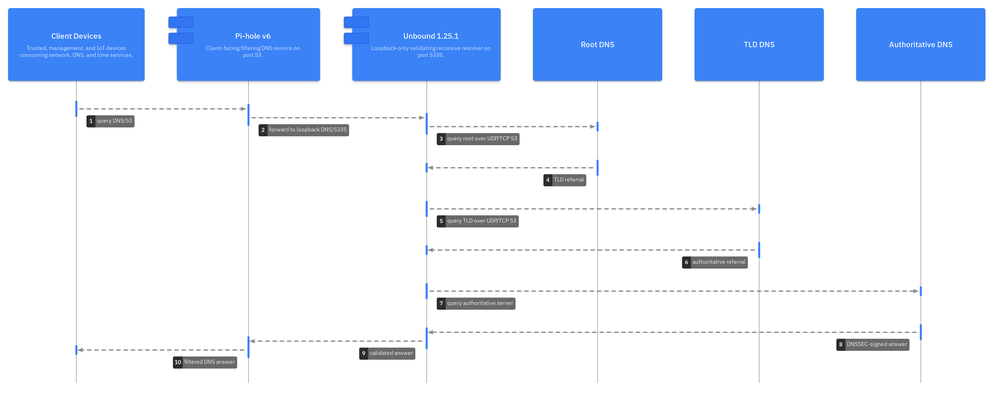
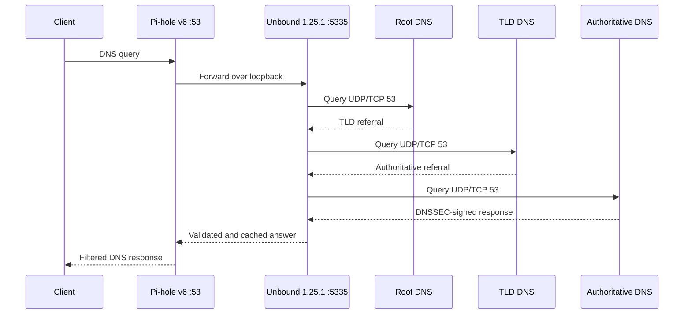

# ⚙️ Scenario 2: Clean Pi-hole v6 Configuration

The `unbound-pihole-profile` provides a generic, loopback-only, validating
recursive resolver. It deliberately contains no private hostname, local zone,
or third-party forwarding service.



## 🌐 Recursive DNS path



## ⚙️ Generic profile

The managed conffile `/etc/unbound/unbound.conf.d/pihole.conf` should have
this operational shape:

```conf
server:
    interface: 127.0.0.1
    interface: ::1
    port: 5335

    access-control: 127.0.0.1 allow
    access-control: ::1 allow

    do-ip4: yes
    do-ip6: yes
    do-udp: yes
    do-tcp: yes
    prefer-ip6: no

    hide-identity: yes
    hide-version: yes
    harden-glue: yes
    harden-dnssec-stripped: yes
    qname-minimisation: yes
    minimal-responses: yes
    deny-any: yes
    edns-buffer-size: 1232
    prefetch: yes
    prefetch-key: yes

    num-threads: 1
    rrset-cache-size: 64m
    msg-cache-size: 32m
    so-reuseport: yes
    so-rcvbuf: 4m
    so-sndbuf: 4m

    private-address: 10.0.0.0/8
    private-address: 172.16.0.0/12
    private-address: 192.168.0.0/16
    private-address: 169.254.0.0/16
    private-address: fd00::/7
    private-address: fe80::/10
    private-address: ::ffff:0:0/96
```

Debian's separate trust-anchor include remains responsible for
`/var/lib/unbound/root.key`. The profile omits `root-hints` so the
`dns-root-data` package and Unbound's packaged defaults remain authoritative.

## 🔐 DNSSEC ownership

Unbound validates DNSSEC; Pi-hole does not validate a second time:

```bash
sudo pihole-FTL --config dns.dnssec false
sudo -u unbound test -r /var/lib/unbound/root.key
sudo -u unbound test -w /var/lib/unbound/root.key
```

Validate behavior:

```bash
dig @127.0.0.1 -p 5335 dnssec.works A +dnssec
dig @127.0.0.1 -p 5335 fail01.dnssec.works A +dnssec
```

## 🌐 Network and firewall policy

- Inbound LAN DNS/53 terminates at Pi-hole.
- Unbound accepts only loopback DNS/5335.
- Unbound requires outbound IPv4 and IPv6 UDP/TCP 53.
- No inbound firewall exception for port 5335 is needed.
- No outbound TCP 853 rule is required because this profile does not use DoT.

```bash
sudo ss -lntup | grep -E '(:53|:5335)[[:space:]]'
dig @198.41.0.4 . NS +norec +time=3
dig @198.41.0.4 . NS +norec +tcp +time=3
```

## 📊 Raspberry Pi 5 resource policy

The generic profile starts conservatively with one worker thread, 64 MiB
RRset cache, and 32 MiB message cache. Increase these only after observing
query volume, memory headroom, cache hit rate, and dropped packets.

```bash
free -h
sudo unbound-control stats_noreset | sed -n '1,100p'
sysctl net.core.rmem_max net.core.wmem_max
```

Required persistent values:

```conf
net.core.rmem_max = 4194304
net.core.wmem_max = 4194304
```

## 📊 Logging and monitoring

The generic profile omits `logfile`, so Debian sends service messages to the
system journal. This avoids custom AppArmor and logrotate policy.

```bash
sudo journalctl -u unbound -b --no-pager
sudo journalctl -u unbound --since '1 hour ago' --no-pager
sudo unbound-control stats_noreset
```

Keep query and reply logging disabled during normal operation.

## ⚙️ Pi-hole v6 configuration ownership

Pi-hole v6 stores settings in `/etc/pihole/pihole.toml`. Prefer the CLI over
direct edits because it validates input:

```bash
sudo pihole-FTL --config dns.upstreams \
  '[ "127.0.0.1#5335", "::1#5335" ]'
sudo pihole-FTL --config dns.dnssec false
sudo systemctl restart pihole-FTL
```

Environment variables have higher precedence than TOML. A setting controlled
by `FTLCONF_dns_upstreams` or `FTLCONF_dns_dnssec` cannot be changed through
the CLI until the environment override is removed.

## 🌐 Optional home.arpa local zone

The package installs a disabled example under
`/usr/share/doc/unbound-pihole-profile/examples`. Copy it into
`/etc/unbound/unbound.conf.d` only when Unbound will be the authoritative
source for local records.

```conf
server:
    private-domain: "home.arpa"
    domain-insecure: "home.arpa"
    local-zone: "home.arpa." static
    local-data: "router.home.arpa. IN A 192.168.1.1"
    local-data-ptr: "192.168.1.1 router.home.arpa."
```

Validate before reload:

```bash
sudo unbound-checkconf /etc/unbound/unbound.conf
sudo unbound-control reload
dig @127.0.0.1 -p 5335 router.home.arpa A
dig @127.0.0.1 -p 5335 -x 192.168.1.1
```

Do not duplicate the same records in Pi-hole Local DNS.

## ✅ Configuration acceptance

```bash
sudo unbound-checkconf /etc/unbound/unbound.conf
systemctl is-active unbound pihole-FTL
sudo unbound-control status
dig @127.0.0.1 -p 5335 dnssec.works A +dnssec
dig @127.0.0.1 dnssec.works A +dnssec
sudo journalctl -u unbound -b --no-pager
```

Acceptance requires valid configuration, loopback-only port 5335, correct
DNSSEC behavior, Pi-hole forwarding, and no recurring warnings.

## 📚 Related documentation

- [Scenario 2 installation](scenario-2-clean-installation.md)
- [Scenario 2 troubleshooting](scenario-2-clean-troubleshooting.md)
- [Pi-hole v6 configuration reference](https://docs.pi-hole.net/ftldns/configfile/)
