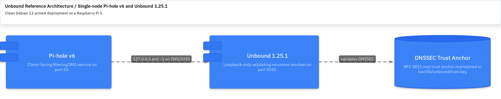
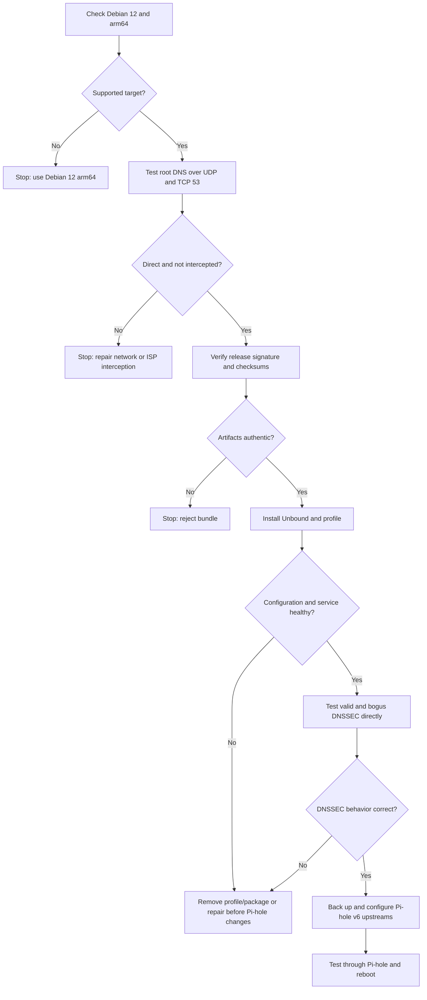

# 🚀 Scenario 2: Clean Pi-hole v6 Installation

This runbook installs the signed Unbound 1.25.1 Debian 12 arm64 backport and
the generic `unbound-pihole-profile` on one Raspberry Pi 5. Pi-hole v6 must be
installed and healthy before integration. The profile performs full recursive
resolution and contains no private local-zone records.



## 📋 Safety boundaries

- Run all target commands on the Raspberry Pi unless marked “workstation.”
- Do not change Pi-hole upstreams until direct Unbound tests pass.
- Do not proceed when root DNS is blocked or intercepted.
- Back up Pi-hole before changing `dns.upstreams`.
- The package does not modify Pi-hole, the firewall, or `/etc/resolv.conf`.



## ✅ Verify the target

```bash
hostnamectl
dpkg --print-architecture
cat /etc/debian_version
pihole -v
timedatectl status
systemctl status pihole-FTL --no-pager
sudo ss -lntup | grep -E '(:53|:5335)[[:space:]]' || true
```

Expected: Debian 12, `arm64`, synchronized time, healthy Pi-hole v6 on port
53, and no listener on port 5335.

## 🌐 Prove direct root-server access

Run all three checks before installing a recursive resolver:

```bash
dig @198.41.0.4 . NS +norec +time=3
dig @198.41.0.4 . NS +norec +tcp +time=3
dig @198.41.0.4 version.bind CH TXT +time=3
```

The first two responses must include `aa` and omit `ra`. The CHAOS response
from this root-server address should identify `ATLAS`. An `ra` response,
unexpected identity, or TCP timeout indicates interception or filtering;
stop until the network path is corrected. See the
[official Pi-hole Unbound guide](https://docs.pi-hole.net/guides/dns/unbound/).

For native IPv6, also query a known root-server IPv6 address and confirm the
same authoritative behavior.

## 🔐 Verify the signed release bundle

On the workstation:

```bash
gpg --verify SHA256SUMS.asc SHA256SUMS
sha256sum --check SHA256SUMS
```

Expected: a trusted release-key signature and `OK` for every artifact. Copy
the verified bundle to the target over an authenticated channel, then rerun
`sha256sum --check SHA256SUMS` on the target.

## 🔐 Back up Pi-hole v6

```bash
backup_root="/var/backups/unbound-clean-install-$(date -u +%Y%m%dT%H%M%SZ)"
sudo install -d -m 0700 "$backup_root"
sudo cp -a /etc/pihole "$backup_root/pihole"
sudo pihole-FTL --config dns.upstreams \
  | sudo tee "$backup_root/dns-upstreams.before.txt" >/dev/null
sudo ls -la "$backup_root"
```

Expected: a protected copy of `pihole.toml` and the prior upstream value.

## 🚀 Install the packages

From the verified bundle directory on the target:

```bash
sudo apt update
sudo apt install ./packages/*.deb
sudo systemctl disable --now unbound-resolvconf.service 2>/dev/null || true
sudo rm -f /etc/unbound/unbound.conf.d/resolvconf_resolvers.conf
```

The runtime bundle must include compatible `unbound`, `libunbound8`, and
`unbound-pihole-profile` packages. Abort if `apt` proposes removing Pi-hole or
core networking packages.

Verify that package installation did not redirect the host resolver:

```bash
cat /etc/resolv.conf
systemctl is-enabled unbound-resolvconf.service 2>/dev/null || true
```

## ⚙️ Apply kernel socket-buffer limits

```bash
sudo tee /etc/sysctl.d/unbound-socket-buffers.conf >/dev/null <<'EOF'
# Permit the 4 MiB socket buffers requested by the Pi-hole Unbound profile.
net.core.rmem_max = 4194304
net.core.wmem_max = 4194304
EOF
sudo sysctl --system
sysctl net.core.rmem_max net.core.wmem_max
```

Expected: both values are at least `4194304`.

## ✅ Validate Unbound before Pi-hole changes

```bash
sudo unbound-checkconf /etc/unbound/unbound.conf
sudo systemctl restart unbound
systemctl status unbound --no-pager
unbound -V
sudo ss -lntup | grep -E '(:5335[[:space:]])'
sudo unbound-control status
```

Expected: Unbound 1.25.1 is active and listens only on `127.0.0.1:5335` and
`[::1]:5335`.

Test recursion and DNSSEC directly:

```bash
dig @127.0.0.1 -p 5335 dnssec.works A +dnssec
dig @127.0.0.1 -p 5335 fail01.dnssec.works A +dnssec
dig @::1 -p 5335 dnssec.works AAAA +dnssec
```

Expected: `dnssec.works` returns `NOERROR` with `ad`; the deliberately bogus
domain returns `SERVFAIL`. Do not configure Pi-hole if these checks fail.

## ⚙️ Configure Pi-hole v6 explicitly

Use the supported FTL CLI so values are validated before writing
`/etc/pihole/pihole.toml`:

```bash
sudo pihole-FTL --config dns.upstreams \
  '[ "127.0.0.1#5335", "::1#5335" ]'
sudo pihole-FTL --config dns.dnssec false
sudo systemctl restart pihole-FTL
sudo pihole-FTL --config dns.upstreams
```

The replacement array intentionally removes public Pi-hole upstreams.
Unbound is the single DNSSEC validation layer.

## ✅ Validate through Pi-hole and reboot

```bash
dig @127.0.0.1 dnssec.works A +dnssec
dig @127.0.0.1 fail01.dnssec.works A +dnssec
sudo journalctl -u pihole-FTL -n 100 --no-pager
sudo journalctl -u unbound -n 100 --no-pager
```

Pi-hole must forward to local port 5335 and return the same DNSSEC outcome as
direct Unbound. Reboot once:

```bash
sudo reboot
```

After reconnecting, repeat service, listener, direct DNS, and Pi-hole DNS
tests.

## ↩️ Clean rollback

Restore Pi-hole before stopping Unbound:

```bash
backup_root="/var/backups/unbound-clean-install-YYYYMMDDTHHMMSSZ"
sudo cp -a "$backup_root/pihole/." /etc/pihole/
sudo systemctl restart pihole-FTL
sudo pihole-FTL --config dns.upstreams
```

Verify Pi-hole resolves through its previous upstreams. Then remove the
profile and custom packages:

```bash
sudo apt remove unbound-pihole-profile unbound
sudo systemctl daemon-reload
```

Keep `/etc/unbound` backups or `dpkg` conffile remnants until the rollback is
accepted. Reinstall Debian's repository package only when that is the desired
end state.

## 📚 Related documentation

- [Scenario 2 configuration](scenario-2-clean-configuration.md)
- [Scenario 2 troubleshooting](scenario-2-clean-troubleshooting.md)
