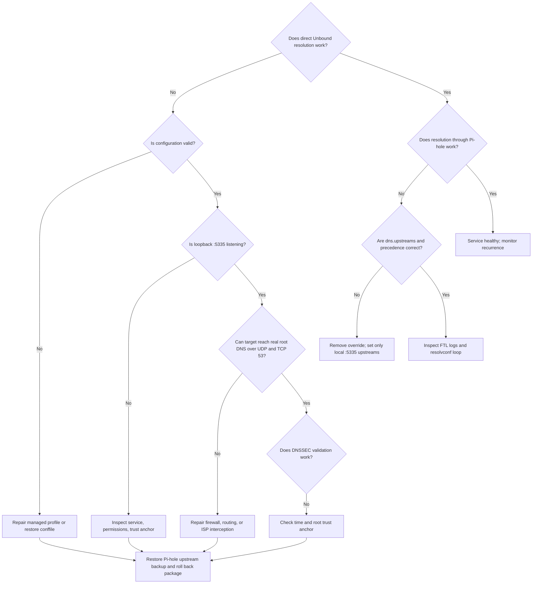

# 🧯 Scenario 2: Clean Pi-hole v6 Troubleshooting

First determine whether Unbound itself fails or Pi-hole v6 fails to use a
healthy Unbound service.

## 🧭 Triage decision tree



## 📋 Capture evidence

```bash
date -u
hostnamectl
systemctl status unbound pihole-FTL --no-pager
sudo journalctl -u unbound -b --no-pager
sudo journalctl -u pihole-FTL -b --no-pager
sudo unbound-checkconf /etc/unbound/unbound.conf
sudo ss -lntup
sudo pihole-FTL --config dns.upstreams
```

Save results before restarting or editing. Do not include private keys.

## 🌐 Root DNS is blocked or intercepted

```bash
dig @198.41.0.4 . NS +norec +time=3
dig @198.41.0.4 . NS +norec +tcp +time=3
dig @198.41.0.4 version.bind CH TXT +time=3
```

Expected: `aa`, no `ra`, and the expected root-server identity. If UDP works
but TCP times out, large DNSSEC answers will fail. Correct the host firewall,
router policy, ISP interception, or CG-NAT behavior before retrying.

## 🌐 Port 5335 conflict

```bash
sudo ss -lntup | grep -E '(:53|:5335)[[:space:]]'
sudo systemctl status unbound pihole-FTL --no-pager
```

Pi-hole must own port 53. Only Unbound should own loopback port 5335. Stop and
remove an unexpected listener rather than changing Unbound to a random port.

## 🔐 Trust-anchor or DNSSEC failure

```bash
timedatectl status
sudo namei -l /var/lib/unbound/root.key
sudo -u unbound unbound-anchor -a /var/lib/unbound/root.key -v
dig @127.0.0.1 -p 5335 dnssec.works A +dnssec
dig @127.0.0.1 -p 5335 fail01.dnssec.works A +dnssec
```

Correct clock or ownership problems before replacing the root key. A valid
domain must return `NOERROR` with `ad`; a bogus domain must return `SERVFAIL`.

## 🌐 IPv6 failures

```bash
ip -6 route
ping -6 -c 3 2606:4700:4700::1111
dig @::1 -p 5335 dnssec.works AAAA +dnssec
sudo journalctl -u unbound -b --no-pager | grep -i ipv6 || true
```

The profile assumes reliable native IPv6. Repair routing first. If the target
does not actually have native IPv6, make a reviewed configuration change to
`do-ip6: no` and remove the `::1#5335` Pi-hole upstream together.

## ⚙️ Pi-hole v6 CLI or TOML precedence

```bash
sudo pihole-FTL --config dns.upstreams
sudo pihole-FTL --config dns.dnssec
sudo systemctl show pihole-FTL --property=Environment
sudo sed -n '/^\[dns\]/,/^\[/p' /etc/pihole/pihole.toml
```

Environment variables such as `FTLCONF_dns_upstreams` override TOML and make
the CLI setting read-only. Remove the override from the service or deployment
configuration, reload systemd, and set the value through `pihole-FTL --config`.

## 🌐 Public upstreams remain enabled

The upstream array must contain only local Unbound:

```bash
sudo pihole-FTL --config dns.upstreams \
  '[ "127.0.0.1#5335", "::1#5335" ]'
sudo systemctl restart pihole-FTL
sudo pihole-FTL --config dns.upstreams
```

Mixed public and local upstreams can bypass local zones and produce
inconsistent results.

## 🔁 resolvconf recursion loop

```bash
systemctl is-active unbound-resolvconf.service 2>/dev/null || true
cat /etc/resolv.conf
sudo find /etc/unbound/unbound.conf.d -maxdepth 1 \
  -name 'resolvconf_resolvers.conf' -print
```

Disable the helper and remove its generated include. Do not point the host to
`127.0.0.1` expecting it to infer Unbound's nonstandard port.

## 📊 Service, memory, and socket pressure

```bash
free -h
sysctl net.core.rmem_max net.core.wmem_max
sudo unbound-control stats_noreset | sed -n '1,120p'
sudo journalctl -u unbound -b --no-pager \
  | grep -Ei 'out of memory|buffer|dropped|resource temporarily unavailable' || true
```

Apply the 4 MiB sysctls when buffer warnings appear. Increase caches or
threads only after measuring sustained load and preserving memory headroom.

## 🌐 Local-zone mistake

The generic profile has no enabled local zone. List loaded local-zone files:

```bash
sudo unbound-checkconf /etc/unbound/unbound.conf
sudo find /etc/unbound/unbound.conf.d -maxdepth 1 -type f -print
dig @127.0.0.1 -p 5335 router.home.arpa A
```

If an example was enabled unintentionally, remove only that administrator
conffile, validate, and reload. Do not delete package-managed base includes.

## ↩️ Restore Pi-hole and remove the package

Restore the saved `/etc/pihole` tree or the exact previous upstream array,
restart FTL, and prove public resolution works before stopping Unbound. Then:

```bash
sudo apt remove unbound-pihole-profile unbound
sudo systemctl daemon-reload
```

Retain `/etc/unbound` and the signed release bundle until the incident is
closed. See [the clean installation rollback](scenario-2-clean-installation.md).

## 📚 Escalation record

Include package versions, target architecture, service logs, listener output,
root-server tests, DNSSEC results, Pi-hole upstream output, and any conffile
diff. Exclude private keys and provider credentials.
